<p align="center">
  
</p>

<p align="center">
  <a href="#install"></a>
  <a href="#install"></a>
  <a href="#install"></a>
  <a href="#windows-and-linux"></a>
</p>

A quiet place to think — a native macOS notepad. Dark, glassy, keyboard-first,
and it saves itself. It opens your files too: Markdown, plain text, code, or
anything else made of text, edited in place.

## The tour



<sub>That's not a video — it's one self-animating SVG (~90 KB, no plugin, no
autoplay policy to fight), drawn from the same palette the app uses. There's a
scored version too, with sound: **[assets/demo.mp4](assets/demo.mp4)** (28s,
1920×1230 — GitHub won't play a video that lives in a repo, so `open
assets/demo.mp4`). Rebuild either with `python3 tools/make_demo.py` and
`./tools/make_demo_video.sh`. And the real thing, in pixels:</sub>


## Install

Poe is built from source. It's one Swift package with no dependencies, so this
takes about a minute.

### 1. What you need

| | |
|---|---|
| **macOS 13** (Ventura) or later | Poe uses SwiftUI features that landed in 13 |
| **Swift 5.9** or later | Xcode 15+, or just the Command Line Tools |

The Command Line Tools are enough — you don't need the full Xcode app:

```bash
xcode-select --install     # skip if you already have Xcode
swift --version            # should say 5.9 or later
```

### 2. Build it

```bash
git clone https://github.com/zahnno/poe.git
cd poe
./build.sh
```

`build.sh` compiles the release binary, renders the app icon from
`assets/AppIcon.png` at every size macOS asks for, assembles `build/Poe.app`,
and ad-hoc signs it. Try it before installing:

```bash
open build/Poe.app
```

### 3. Install it

```bash
cp -R build/Poe.app /Applications/
```

That's the whole install. Poe keeps its notes in
`~/Library/Application Support/Poe/`, writes nothing else, and phones nowhere.

<details>
<summary><b>Building a universal binary (Apple silicon + Intel)</b></summary>

`build.sh` builds for the Mac you're on. To produce one app that runs on both:

```bash
swift build -c release --arch arm64 --arch x86_64
cp .build/apple/Products/Release/Poe build/Poe.app/Contents/MacOS/Poe
codesign --force --sign - build/Poe.app
```

Run `./build.sh` first so the bundle exists to copy into.
</details>

<details>
<summary><b>"Poe can't be opened because Apple cannot check it"</b></summary>

Poe is signed ad-hoc — with no Apple Developer certificate — because it's built
on your own machine. macOS is fine with that for an app you compiled yourself.
You'll only see the warning if the `.app` reached you as a *download* (a zip
from someone else, say), which puts it in quarantine:

```bash
xattr -dr com.apple.quarantine /Applications/Poe.app
```

Or right-click the app → **Open** → **Open**, once.
</details>

<details>
<summary><b>Updating and uninstalling</b></summary>

Update:

```bash
git pull && ./build.sh && cp -R build/Poe.app /Applications/
```

Quit Poe first — copying over a running app confuses macOS. Your notes live
outside the bundle and survive.

Uninstall:

```bash
rm -rf /Applications/Poe.app
rm -rf ~/Library/Application\ Support/Poe   # only if you want the notes gone too
```
</details>

## Windows and Linux

**Not today, and not without real work.** Being straight about why, since the
answer decides whether it's worth starting:

Poe isn't merely *compiled* for macOS — it's *made of* macOS. The window is
SwiftUI, the editor is an `NSTextView` from AppKit with a custom caret and layout
manager, the icon and the lantern are drawn in Core Graphics, and the file layer
speaks `UniformTypeIdentifiers`. Swift itself runs beautifully on Windows and
Linux; SwiftUI and AppKit are Apple-only and aren't coming. There's no build
flag, no compatibility shim, and no VM trick — a `.app` is not a thing Windows
knows how to run.

What a port would actually mean:

| Layer | Lines | Portable? |
|---|---|---|
| `Model/Note.swift` | 91 | **Yes** — pure Foundation, compiles as-is |
| `Model/TextFile.swift` | 199 | **Nearly** — Foundation, plus one `UTType` call to swap for extension matching |
| `Model/NoteStore.swift` | 475 | Mostly — the persistence and command logic is portable; the open/save panels aren't |
| Everything in `Views/` + `Theme.swift` | ~1,850 | **No** — rewrite against a Windows UI toolkit |
| `tools/make_icon.swift` | — | No — Core Graphics |

So about a quarter of the code crosses over unchanged, and the interesting part —
an editor that styles markdown live without ever touching the buffer — has to be
rebuilt on WinUI 3, Qt, or Electron. That's a fork sharing a model layer, not a
build flag.

If you want it, open an issue and say which toolkit; the model layer is already
clean enough to lift out into its own target.

## Shortcuts

| | |
|---|---|
| `⌘N` | New note |
| `⌘O` | Open a file |
| `⌘F` | Find in this note |
| `⌘G` / `⇧⌘G` | Next / previous match |
| `⌘E` | Use the selection as the search term |
| `⇧⌘F` | Search every note |
| `⌘P` | Toggle markdown preview |
| `⌘D` | Pin / unpin |
| `⇧⌘D` | Duplicate |
| `⌘0` | Toggle sidebar (focus mode) |
| `⌥⌘↑` / `⌥⌘↓` | Previous / next note |
| `⌘⌫` | Delete note (asks first, unless empty) |
| `⌘S` | Save now |
| `⇧⌘S` | Save as… (and edit there from then on) |
| `⌘R` | Reload the open file from disk |
| `⇧⌘R` | Reveal the open file in Finder |

## Opening files

Poe opens a file three ways: `⌘O`, dragging it onto the window, or double-clicking
it in Finder (`open -a Poe notes.md` works too — Poe registers as an editor for
Markdown, plain text, source code, and structured text like JSON and YAML).

An opened file becomes a note that is *tethered* to it. It shows up in the
sidebar with its extension on a chip, it is searchable alongside everything else,
and every keystroke goes back to the file on disk — in the encoding and line
endings it arrived with, so a Latin-1 file with CRLF newlines stays exactly that.
Change the file in another editor and Poe picks the change up when it comes back
to the front. **Note → Stop Editing File** keeps the text and drops the tether;
deleting the note leaves the file alone.

Anything that isn't text is refused with a reason, as is anything over 8 MB.

Markdown and plain text are **styled as you write**: headings grow, `**bold**`,
`*italic*`, `` `code` ``, quotes, lists, task boxes and links all take hold, and
the syntax that produces them dims rather than disappearing — the buffer stays
exactly the text on disk. A `.md` file opens in the rendered preview; `⌘P` (or
the pencil) switches to editing. Code and data files get tighter line spacing
and no styling or spell-check. Styling is scoped to what's on screen, and stands
down entirely past 60 KB, where `⌘P` still renders the whole document.

## Where notes live

`~/Library/Application Support/Poe/notes.json` — one plain JSON document,
written atomically, debounced to at most one write per 0.7s of typing.
**Note → Poe Notes Folder** opens it in Finder.

## Layout

```
Sources/Poe/
  PoeApp.swift          App entry, menu-bar commands, window styling
  Theme.swift           Colours, glass panel, relative dates
  Model/Note.swift      A note, plus derived title/snippet/word count
  Model/TextFile.swift  Reading and writing files without changing them
  Model/NoteStore.swift The library: persistence, selection, commands, files
  Views/RootView.swift  Sidebar + editor layout
  Views/SidebarView.swift
  Views/EditorView.swift
  Views/PoeTextView.swift    NSTextView wrapper (caret glow, line spacing, undo)
  Views/MarkdownStyle.swift  Live markdown styling — attributes only, never text
  Views/MarkdownPreview.swift
  Views/FindBar.swift        Find in note — ⌘F, match stepping, selection sync
  Views/LanternMark.swift    The lantern logo, drawn in Canvas to match the icon
  Views/AuroraBackground.swift
  DebugSnapshot.swift   Dev-only smoke test (see below)
tools/make_icon.swift   Cuts the app icon out of assets/AppIcon.png, every size
tools/make_demo.py      Draws assets/demo.svg — the animated tour up top
tools/capture_frames.mjs   Rasterises that SVG frame by frame, over CDP
tools/make_demo_video.sh   Frames + assets/audio/ stems → assets/demo.mp4
tools/file_tests/       Headless checks for the file layer (see below)
assets/lantern.svg      The mark again, as SVG — same geometry, same bronze
assets/audio/           Bed and effects for the video, generated once
```

## Smoke test

The app can drive itself and screenshot the result — useful because Screen
Recording permission is not needed to capture your own window:

```bash
POE_SELFTEST=1 POE_SNAPSHOT=/tmp/poe .build/release/Poe
```

It types a note, flips to preview, creates a second note, enters focus mode,
writes `/tmp/poe-*.png` at each step, prints the model state, and quits.
Without `POE_SELFTEST` it just captures one screenshot and exits.

`POE_SELFTEST=file` runs the file story instead — open, edit, save back, reopen,
adopt a change made outside Poe, refuse a binary, survive the file being deleted —
and prints a pass/fail line per check:

```bash
cp somewhere/notes.md /tmp/case.md
POE_SELFTEST=file POE_SNAPSHOT=/tmp/poe POE_OPEN=/tmp/case.md .build/release/Poe
```

It rewrites the file it is given, so hand it a copy.

`POE_SELFTEST=scroll` drags a long note past the window — plain, with the find
bar up, and after stepping through matches — and checks that the scroll lands
where it was pushed, that nothing pulls it back, and that the frames don't each
pay for a restyle:

```bash
POE_SELFTEST=scroll POE_SNAPSHOT=/tmp/poe POE_LIBRARY=/tmp/poe-library .build/release/Poe
```

`POE_LIBRARY` points the library somewhere disposable — worth setting for any of
these, since a harness that types into notes will otherwise type into yours.

The parts that need no window run without one:

```bash
swiftc Sources/Poe/Model/TextFile.swift Sources/Poe/Model/Note.swift \
       tools/file_tests/main.swift -o /tmp/poe-file-tests && /tmp/poe-file-tests
```

## Notes on the design

- The editor is an `NSTextView`, not `TextEditor`, so it can have a glowing
  caret, real line spacing, a text container inset, and proper undo.
- It stays mounted at all times; the markdown preview layers over it. Swapping
  them as `if/else` branches made SwiftUI rebuild the text view on every
  toggle — which lost undo history and dropped note switches on the floor.
- `NoteStore` is a singleton rather than an `@StateObject` on the `App`.
  Menu commands are built outside any view's lifetime, and SwiftUI hands them
  their own uninitialised copy of a `@StateObject` — every shortcut silently
  did nothing until this changed.
- The text is handed to `PoeTextView` by value, not as a `@Binding`. SwiftUI
  diffs a representable on its stored properties, and a binding's *contents* are
  invisible to that comparison — so text that changed anywhere but in the editor
  (a reload from disk, a file edited in another app) never reached the buffer
  until some unrelated redraw happened along.
- One text view serves every document, which means it carries things between
  them. Switching documents clears the undo stack, because undoing into a file
  would splice the previous note's words into it, and macOS autocorrection is
  off, because it rewrites text *asynchronously* — a correction queued against
  one document used to land in the next one, on disk.
- Files arrive through two doors. SwiftUI claims the open-documents event for a
  `WindowGroup` app and hands `application(_:open:)` an empty list, so
  `RootView.onOpenURL` catches most of them; the delegate still sees some.
  Opening a path already in the library re-selects it instead of cloning it.
- The markdown preview parses in `init` and lays out lazily. It used to re-split
  every line and build every view on each redraw, which is most of a second in a
  100 KB note — invisible until files could be opened and one of them was large.
- The aurora is four blurred orbs on `repeatForever` transform animations, so
  the compositor owns it and nothing spins the fans while you type.
- The demo at the top is generated, not recorded. Every animation in it runs the
  full 28s of the timeline and repeats forever, with the scene changes encoded in
  `keyTimes` — give each element its own `begin` offset instead and the loop
  drifts out of sync on the second pass. The typing is a clip rectangle per line
  whose width steps one character at a time, which is why the caret and the text
  can never disagree about where the next letter goes.
- The video is rendered, not recorded. `capture_frames.mjs` pauses the SVG's SMIL
  clock and asks for frame *n* at exactly *n*/30 s, which is the only reason a
  sound effect can be placed at a timecode and land on the frame it belongs to —
  a screen recorder would hand back whatever Chrome happened to paint.
