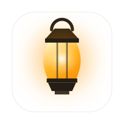
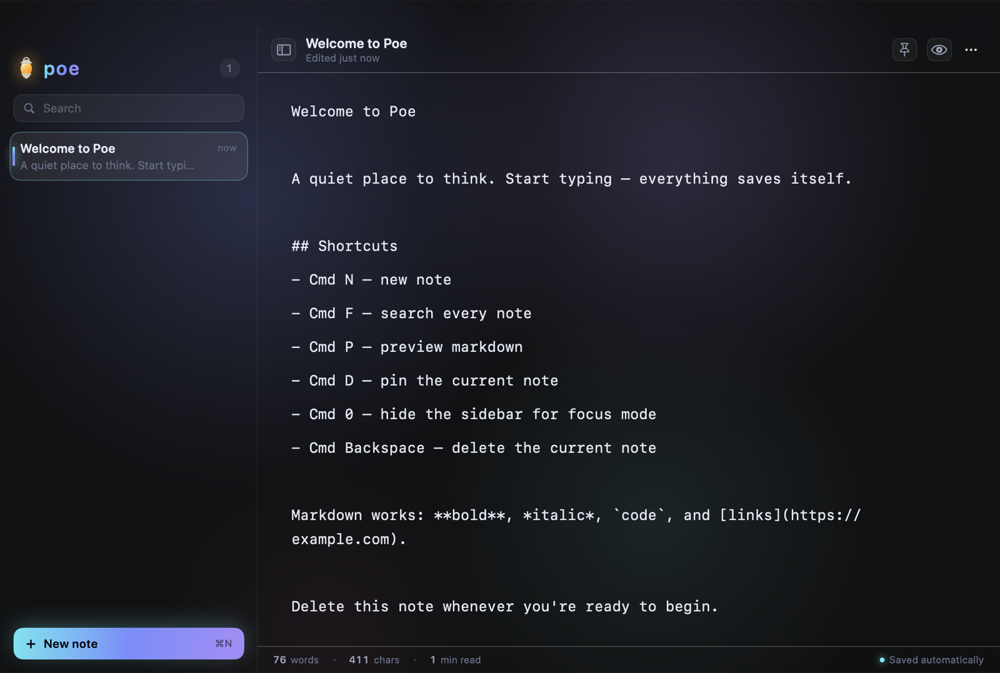

# Poe

A quiet place to think — a native macOS notepad. Dark, glassy, keyboard-first,
and it saves itself.

<p></p>



## Build

```bash
./build.sh
open build/Poe.app
```

Requires Xcode 15 / Swift 5.9 and macOS 13 or later. No dependencies — SwiftUI,
AppKit, and Core Graphics only. `build.sh` compiles the executable, draws the
lantern icon from `tools/make_icon.swift`, assembles `build/Poe.app`, and
ad-hoc signs it.

To install: `cp -R build/Poe.app /Applications/`

## Shortcuts

| | |
|---|---|
| `⌘N` | New note |
| `⌘F` | Search every note |
| `⌘P` | Toggle markdown preview |
| `⌘D` | Pin / unpin |
| `⇧⌘D` | Duplicate |
| `⌘0` | Toggle sidebar (focus mode) |
| `⌥⌘↑` / `⌥⌘↓` | Previous / next note |
| `⌘⌫` | Delete note (asks first, unless empty) |
| `⌘S` | Save now |
| `⇧⌘S` | Export as Markdown |

## Where notes live

`~/Library/Application Support/Poe/notes.json` — one plain JSON document,
written atomically, debounced to at most one write per 0.7s of typing.
**Note → Poe Notes Folder** opens it in Finder.

## Layout

```
Sources/Poe/
  PoeApp.swift          App entry, menu-bar commands, window styling
  Theme.swift           Colours, glass panel, relative dates
  Model/Note.swift      A note, plus derived title/snippet/word count
  Model/NoteStore.swift The library: persistence, selection, commands
  Views/RootView.swift  Sidebar + editor layout
  Views/SidebarView.swift
  Views/EditorView.swift
  Views/PoeTextView.swift    NSTextView wrapper (caret glow, line spacing, undo)
  Views/MarkdownPreview.swift
  Views/LanternMark.swift    The lantern logo, drawn in Canvas
  Views/AuroraBackground.swift
  DebugSnapshot.swift   Dev-only smoke test (see below)
tools/make_icon.swift   Draws the app icon at every size
```

## Smoke test

The app can drive itself and screenshot the result — useful because Screen
Recording permission is not needed to capture your own window:

```bash
POE_SELFTEST=1 POE_SNAPSHOT=/tmp/poe .build/release/Poe
```

It types a note, flips to preview, creates a second note, enters focus mode,
writes `/tmp/poe-*.png` at each step, prints the model state, and quits.
Without `POE_SELFTEST` it just captures one screenshot and exits.

## Notes on the design

- The editor is an `NSTextView`, not `TextEditor`, so it can have a glowing
  caret, real line spacing, a text container inset, and proper undo.
- It stays mounted at all times; the markdown preview layers over it. Swapping
  them as `if/else` branches made SwiftUI rebuild the text view on every
  toggle — which lost undo history and dropped note switches on the floor.
- `NoteStore` is a singleton rather than an `@StateObject` on the `App`.
  Menu commands are built outside any view's lifetime, and SwiftUI hands them
  their own uninitialised copy of a `@StateObject` — every shortcut silently
  did nothing until this changed.
- The aurora is four blurred orbs on `repeatForever` transform animations, so
  the compositor owns it and nothing spins the fans while you type.
